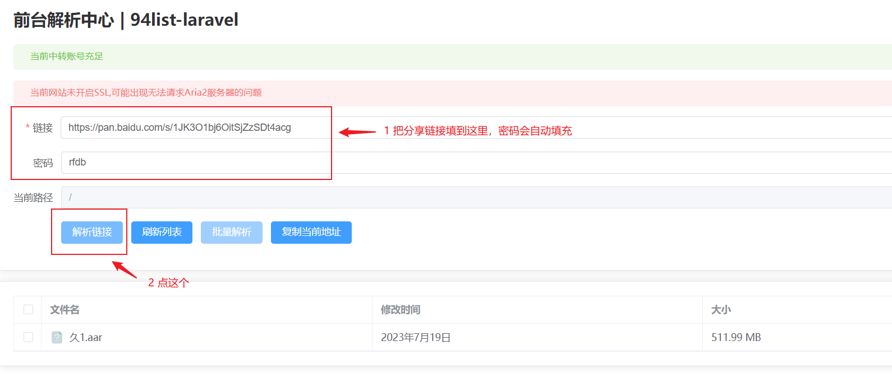
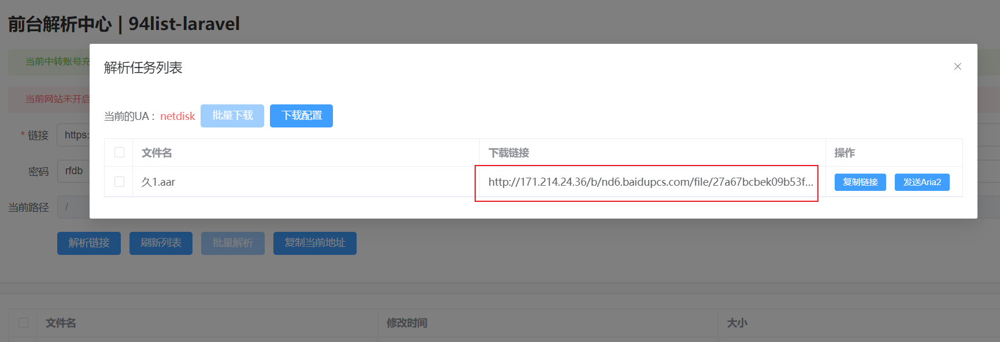
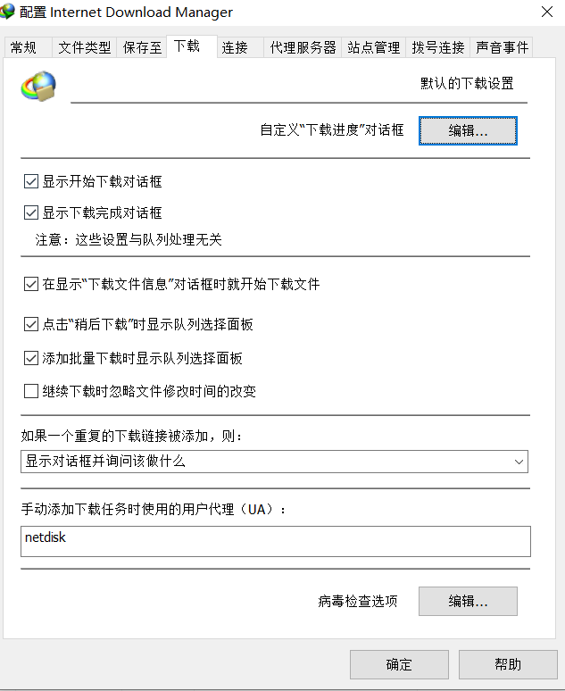

## 0.写在前面

网站是搭建在我的服务器上的，没做防护，使用的账号也是我对象开的会员提取的，所以不要分享，自用即可

## 1.使用原理

获取存储在百度云盘的文件的真实下载地址，然后使用专门的下载器下载到本地

## 2.获取下载地址

打开网站http://106.52.174.151:8084/

双击出现的文件，或者点击上面的按钮【批量解析】，就会出现

这里获取到的就是真实的下载地址

## 3.使用下载器下载

这里大概有两种下载方式，一个是复制链接到下载器下载，另一个是发送给Aria2（这种方式可以批量下载，我设置的最大数量是20个）

## 4.下载器的选择

### 4.1 Windows

- IDM 神器下载 备份地址：https://dulongxiang.lanzoum.com/idbOq0dohesh，如果使用这个下载需要改一下下载UA为netdisk（下载->选项->下载，最下方）

- Aria2 地址 https://dulongxiang.lanzoum.com/iU8fK1qqu5ti，解压使用，打开解压后的文件夹，双击“AriaNg启动器.exe”
- Mortrix https://motrix.app/download

### 4.2 Android

1. ADM https://dulongxiang.lanzoum.com/iD8C11qquzti
2. Aria2 https://dulongxiang.lanzoum.com/iD8C11qquzti

### 4.3 iOS

暂时没研究

### 4.4Mac

Mortrix https://motrix.app/download

